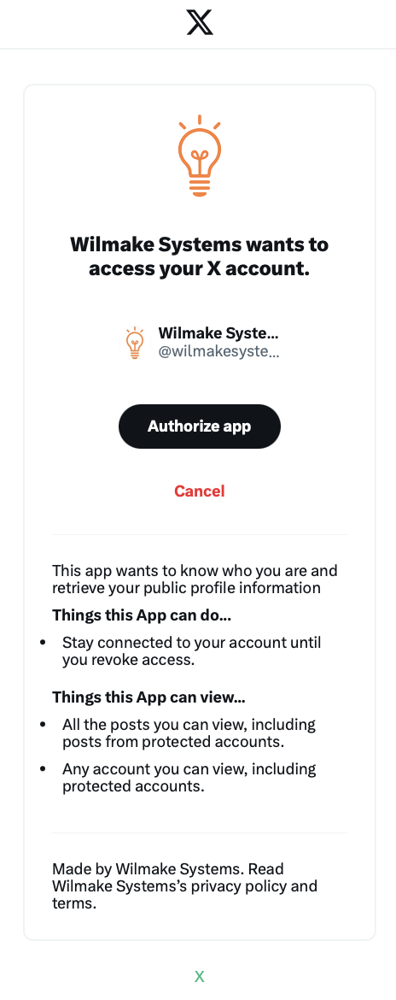

**SimplerAuth Provider** allows for zero-config X OAuth for all your applications and downstream clients.

# Why

- X Free or Basic just allows creating a single client
- A single client can have up to just 10 callback URLs, which limits you in how many apps you can create
- To bypass this problem, you can use the `simplerauth-client` to create unlimited X Authed Apps (even without a client)
- Wrap your fetch handler with `withSimplerAuth(handler,config)` and you'll have access to `ctx.user`. That's literally it!

# Features

- **Secretless** - no secrets needed due to the 'hostname as client-id' principle.
- **Stateless** - no state needed since every user gets their own tiny DB in the provider, yielding super high performance
- **Self-hostable** - Works with login.wilmake.com by default, but you can also host your own X OAuth Provider and configure that.
- **Provider** - when using `simplerauth-client` other clients can login with your service too.

# Usage

You can use this client by 'Wilmake Systems', that is hosted at https://login.wilmake.com, with very easy set-up.

This is how the OAuth flow looks when using the hosted setup:



Please note that the hosted provider is fully permissive for the `profile` scope. If a user gave any app access to their profile information, any other app can also get this information. **This is by design**.

When not to choose hosted:

- If you don't want other apps to be authorized to get profile information of users that logged into your app(s)
- If you want to retrieve the real X Access token with custom scopes
- If you want full control over the X OAuth client (with icon and user connected to it)

In these cases, a better choice is the internal, or easier, central setup, which allows you to configure exactly which clients get access to this. For this, check out [x-oauth-provider](x-oauth-provider/) for more info.

To use the client for any of your apps (hosted by ourself or us, all the same), just do this:

```
npm i simplerauth-client
```

```ts
import { withSimplerAuth } from "simplerauth-client";
export default {
  fetch: withSimplerAuth(handler, config),
};
```

**Development in localhost** - Login with localhost should 'just work'. The client assumes localhost:8787 by default. If you use another port, set `env.PORT=YOUR_PORT`.

See [the code](simplerauth-client/client.ts) for more details. See [x-oauth-provider](x-oauth-provider/) for self-hosting options. Go to https://client.simplerauth.com to see [this demo code, live](simplerauth-client/demo.ts)
