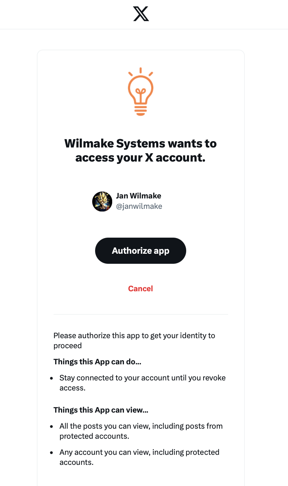
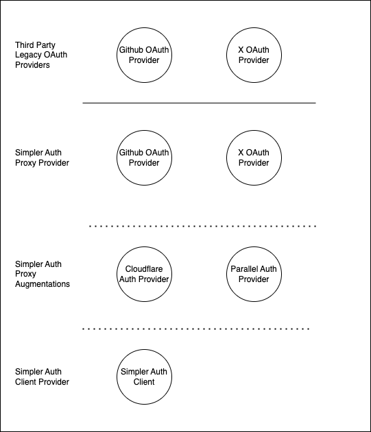

# SimplerAuth Provider - Zero-Config OAuth Clients & Providers

> Please note: This repo consists of many smaller modules that can be used independently
>
> Be advised: While some are stable and of high-quality, others are in active development and may still be buggy.
>
> Truly experimental modules and community modules are not part of this repo but are kept track of in [this list](https://github.com/stars/janwilmake/lists/simpler-auth). Please [DM Me](https://x.com/janwilmake) if you have built a new Simpler Auth Module so I can add it!

# Features [simplerauth-client](simplerauth-client/)

- Wrap your fetch handler with `withSimplerAuth(handler,config)` and you'll have access to `ctx.user`. That's literally it!
- **Secretless** - no secrets needed due to the 'hostname as client-id' principle.
- **Stateless** - no state needed since every user gets their own tiny DB in the provider, yielding super high performance
- **Self-hostable** - Works with login.wilmake.com by default, but you can also host your own X OAuth Provider and configure that.
- **Provider** - when using `simplerauth-client` other clients can login with your service too.

# Security

One of the design goals of Simpler Auth is to be fully compliant with [the MCP Authorization spec](https://modelcontextprotocol.io/specification/draft/basic/authorization) and to follow their [security best practices](https://modelcontextprotocol.io/specification/draft/basic/security_best_practices).

I know this isn't proof, but you can prompt the source code on security, and see it's rated quite well by Claude:

[](https://letmeprompt.com/rules-httpsuithu-ynxf1f0)

I'll work on a more formal way to ensure it works. Let me know if you have experience, would love contributions here.

# Usage

By default the `simplerauth-client` connects to an X Client named 'Wilmake Systems' that is hosted at https://login.wilmake.com. This is how the OAuth flow looks when using the hosted setup:



Please note that the hosted provider is fully permissive for the `profile` scope. If a user gave any app access to their profile information, any other app can also get this information. **This is by design**.

When not to choose hosted:

- If you don't want other apps to be authorized to get profile information of users that logged into your app(s)
- If you want to retrieve the real X Access token with custom scopes
- If you want full control over the X OAuth client (with icon and user connected to it)

In these cases, a better choice is the internal, or easier, central setup, which allows you to configure exactly which clients get access to this. For this, check out [x-oauth-provider](x-oauth-provider/) for more info.

To use the client for any of your apps (hosted by ourself or us, all the same), just do this:

```
npm i simplerauth-client
```

```ts
import { withSimplerAuth } from "simplerauth-client";
export default {
  fetch: withSimplerAuth(handler, config),
};
```

**Development in localhost** - Login with localhost should 'just work'. The client assumes localhost:8787 by default. If you use another port, set `env.PORT=YOUR_PORT`.

See [the code](simplerauth-client/client.ts) for more details. See [x-oauth-provider](x-oauth-provider/) for self-hosting options. Go to https://client.simplerauth.com to see [this demo code, live](simplerauth-client/demo.ts)

# The Vision: Stackable OAuth Providers

OAuth is the status quo for SSO logins, but the ill adoption of its full specification has created a lot of friction for integrations. New primitives such as [hostname-as-client-id](BLOG.md) and well-implemented dynamic client registration have the potential to remove all friction that OAuth gives us, and this is the goal of Simpler Auth: Allow millions of integrations with zero config and minimum end-user friction.



As you can see in this illustration, first, Simpler Auth proxies legacy OAuth providers into an agent-friendly oauth provider proxy, [x-oauth-provider](x-oauth-provider) being the first. With that, apps can use [simplerauth-client](simplerauth-client/) directly to connect to a hosted oauth provider, or build it out into a "Simpler Auth Composition" that adds additional functionality into the oauth flow.

The goal of Simpler Auth is to make it easy for any application you're building to not only use oauth for SSO, but also immediately offer OAuth with your app itself to third party client servers, because in the world of agents, the browser is not the only way users use apps anymore. We need OAuth Provided apps out of the box!

Modular and Composable - or "stackable" - auth allows easy creation of oauth provider flows to grant specific scopes or keys, and allows experimentation with new auth flow paradigms: What about...

- an agentic authorization layer for Github repo metadata editing?
- a more fine-grained scoping for cloudflare workers to only allow for editing staging workers?
- a login flow that allows passing LLM provider API keys to a small app?

There's tons of ways in which we can make apps more accessible for AI and with Simpler Auth, we're uncovering this new topic that should be a primitive out of the box for most apps, but isn't.
